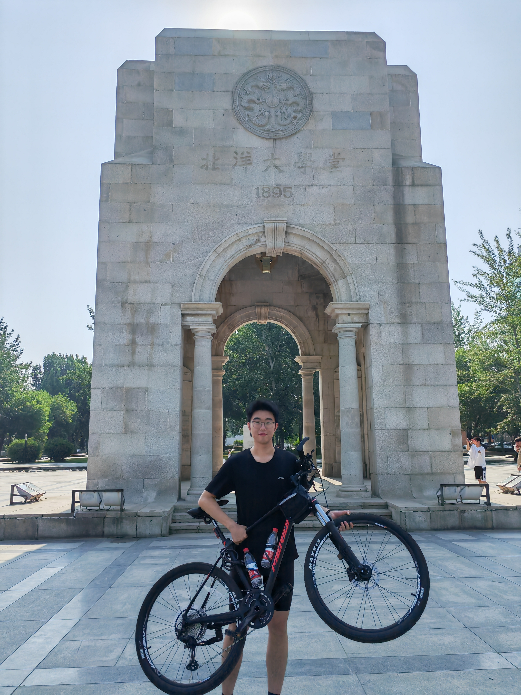

# 欢迎来到邵瑞超的个人网站 🙂
## 写在前面的碎碎念🐕
***“多年之后，面对github，src将会想起，他当年折腾个人网站的那个遥远的下午“***   
这是本电白第一次尝试搭建个人网站，对于在下来说是一个不小的挑战，希望随着在下技（bai)术(piao)力的不断提升，未来这个小小的website也能够成为一个有意思的赛博乐园

## 个人简介
- 学校：清华大学
- 书院：致理书院  
- 专业：生物科学
- 实验室：张二荃lab @NIBS
- 邮箱：src22@mail.tsinghua.edu.cn 📫
- 

## 生物信息学课程笔记
### 2.21第一课 Introduction  
*“We teach professional skills in bioinformatics. These skills are not just running software. They will give you freedom of exploring various real data.”*

* Four steps of bioinformatics
  **Question→Information→Analysis→Modeling**

0. Question
   * R(Robot)N(Nanotech)G(Genetics)

1. Information  
   *Code of life--**Sequence**   
    Sequencing technologies--Revolution   
   * [Human Genome Project] (https://www.genome.gov/human-genome-project)  
     Craig Venter and Francis Collins  
   * NGS(Next-Generation Sequencing)  
   DNA-seq, RNA-seq, Epigenetics, Interaction  
   Three different level: Persons, Cell, Omics  
   *Human Genome Project; The Cancer Genome Atlas(TCGA); UK BioBank*
   * Metagenomics  
     Enviromental(Hot spring, Ocean...); Organismal(gut,lung...)  

   **We are in a age of explosing data**

2. Analysis
   * NGS Data Analysis   
     -Sequencing Method and Bioinformatics Tool     
      ![Sequencing Method and Bioinformatics Tool] (images/Sequencing Method and Bioinformatics Tool.png)  
     -Interpreting the Data  
     Cell Types, Gene Signatures
 
