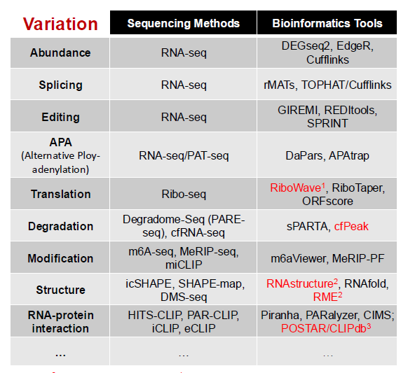
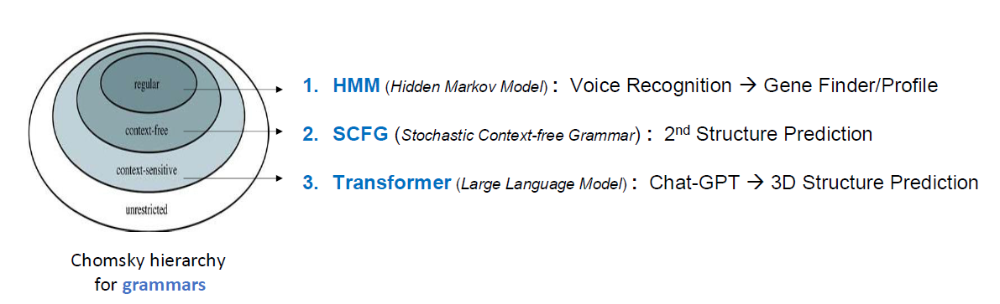

# 生物信息学课程学习计划

***苦学十六周，把不会干实验的帽子甩到中关村北大街对面去(doge)***

## 目标 （To be updated）  
   1. 掌握生物信息学的基础知识
   2. 初步掌握一定的编程能力  
      - Python, R，Linus等基础编程语言  
      - 学会使用Github，学（bai）习（piao）大佬们的开源项目...

   3. 学会进行一些基础的生物信息学分析  
      - 包括序列比对分析，进化树构建，基因表达分析，蛋白质结构预测等等
   4. 应用所学习的生物信息学知识来解决自己实验室工作中的科学问题
      - 主要涉及多器官RNA-seq数据的分析，希望能够改变当前自己只会做湿实验，生信分析完全捉瞎的问题

## 学习计划
  1. **学习掌握理论知识**
     - 在每节课课后，首先对本节课所涉及的生信理论知识进行复习，做到完全理解相关的分析的原理
     - 对于过程中所遇见的难以理解的知识点，寻求多种方法来进行掌握，积极利用网络资料，如知乎，B站，YouTube，AI回答（可以提供一个起步的框架，但需要验证知识的正确性）
  2. **编程实践**
     - 积极地通过实际实践操作来加深对相关生信知识的理解。  
       *由于本人不管是生信知识还是编程能力都十分有限，因此笨鸟先飞，在课后要投入更多的时间来进行操作*
     - 善于利用发达的网络材料以及AI工具。  
       *在制作本网页过程中，我充分地感受到了知识获得的便利性，让我能够从一个完全零基础的起点出发，初步学会Github的使用，并且能够搭建出一个简单的个人网站。所以说这些操作并没有想象中的那么难，而更多地是需要我投入时间去耐心的学习。*  
     - 朋辈合作  
       *许多一起选课的同学具有比较强的编程能力和丰富的经验，在实践中可以多向他们请教。同时，要充分发挥每个人不同的强项，由于我相对来说具有比较丰富的湿实验经验，可以与同学们进行讨论，以求激发出灵感的火花。*
     - 行胜于言  
      *~~不行就问deepseek~~，还是要多练，多做，不怕写错，就怕不做*

# 生物信息学课程笔记  
## 2.21第一课 Introduction  
   *“We teach professional skills in bioinformatics. These skills are not just running software. They will give you freedom of exploring various real data.”*

  **Four steps of bioinformatics**  
  **Question→Information→Analysis→Modeling**

### 0. Question
   * 125 questions from *Science*
   * Technology for bioinformatics: R(Robot)N(Nanotech)G(Genetics)
   * _Technology help to solve the scientific questions_

### 1. Information  
   * Code of life--**Sequence**   
     Sequencing technologies--Revolution   
   * Human Genome Project  
     (https://www.genome.gov/human-genome-project)  
     Craig Venter and Francis Collins  
   * NGS(Next-Generation Sequencing)  
     DNA-seq, RNA-seq, Epigenetics, Interaction  
     Three different level: Persons, Cell, Omics  
     Human Genome Project; The Cancer Genome Atlas(TCGA); UK BioBank*
   * Metagenomics  
     Enviromental(Hot spring, Ocean...); Organismal(gut,lung...)  

   **We are in a age of explosing data**

### 2. Analysis
   * NGS Data Analysis   
     - Sequencing Method and Bioinformatics Tool     
      
     - Interpreting the Data  
     Cell Types, Gene Signatures

### 3. Modeling  
   * Regression Model  
     Linear regression: from continuous to continuous  
     Logistic regression: from continuous to categorical  
   * Neural Network Model  
     used for deep learning  
     forward propacation and backward propagation  
     Local optimum and global optimum
   * From linguistics to bioinformatics  
    
 
   * **Model and Algorithm**  
     Some algorithms: Number sorting ~； Dynamic Programming Algorithm  
     **Differences**  
     算法：是解决特定问题过程中所采用的指令和计算方法  
     模型：是基于算法在特定数据集上应用的结果  
     **Personal view: 算法是方法和过程，模型是特定规律的呈现结果**

**Two different approaches**
 - Question/Hypothesis-driven
   Question→Information→Analysis→Modeling
 - Big Data-driven (4th Paradigm)
   Information→Analysis→Modeling→Question